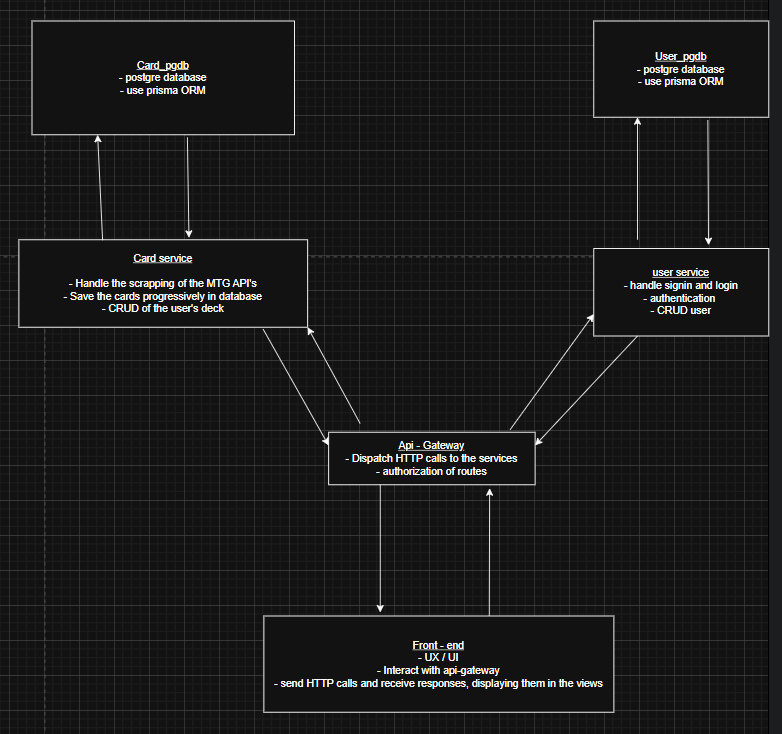

# TP-Fullstack : Deck builder

This deck builder aims to allow the user to search for cards through MTG card databases, and for him to create his own deck.
Ultimately, this app could provide a feature for the user to search cards, not only by name, but also by abilities or potential synergy between cards.

# Head-up

